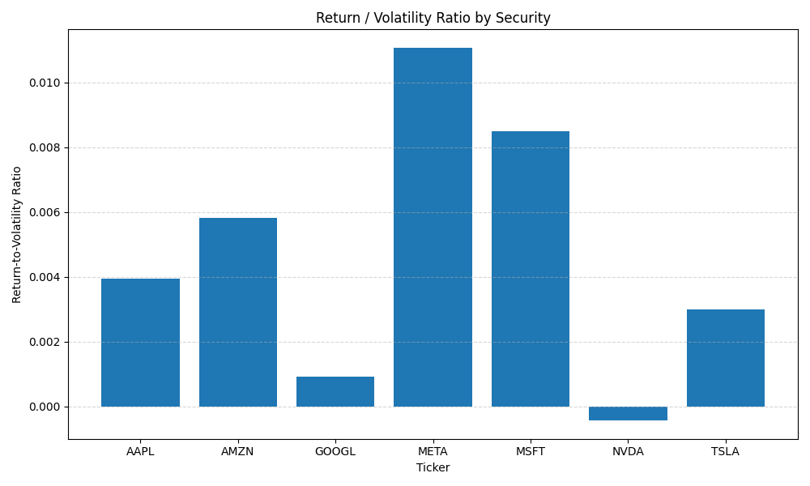
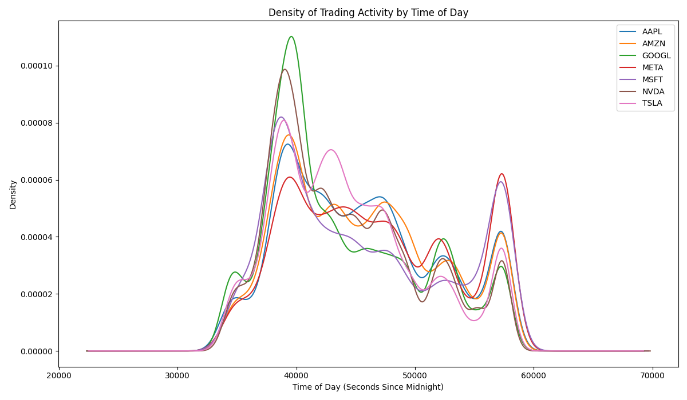
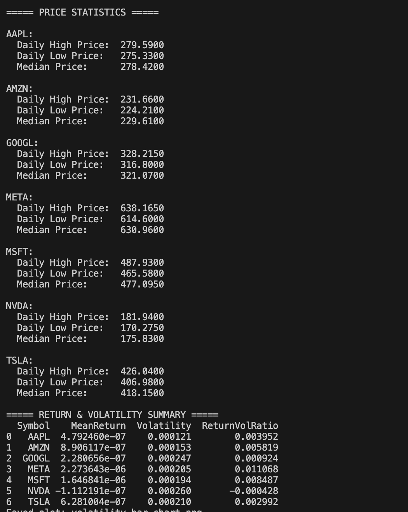

# Submission Write - Tech Financial Trades Analysis

### Names: 
Benjamin Berinsky, Will Wert

### Data Source: 
For our project we used the Alpaca trading API. The API provided us with live streaming information about trades, including the company abbreviation of the trade, the price(in USD), the size(how many shares were traded), and the timestamp at which the trade was made. 

### Challenges
- Some limitations come with using the Alpaca trades streaming API, mainly that we are only subscribed to IEX exchange. This is only representative of about 2-3% of the total market, meaning we are missing a lot of the trading population in our analysis. the main limitation here is our analysis is not fully representative of the volume of trades, but it should still provide a good sample once taking this into consideration.
- A challenge with running our scripts was they had to be active when the market was open, from 9:30 AM-4:00 PM EST. The scripts were run for two complete days to capture all trades on those days in that timeframe. We worked through this issue by being vigilant about starting the scripts before the markets open and keeping them active until they close.
- For our tools, we used Kafka to produce and consume the data from the live streaming API by filtering out which companies we would keep, and then writing out the trades to a table in DuckDB to perform our analysis. 

### Analysis
Our analysis generates three plots and provides useful insights from the data we collected from our stream. The first plot shows the density of trading activity throughout the trading day; as you can see, they all seem to follow a similar pattern: a large spike shortly after the open, a steady decline, and another big spike right before market close. The second plot is a bar chart with the volatility of each security, which we got by calculating the standard deviation over the given period; in this case, it was two days. For the final plot, we wanted to know what the ratio of returns to volatility was, and arrived at that simply by dividing the daily relative change in stock price by the volatility calculated previously. Finally, we printed the daily high price, low price, and median price for each name. These charts and insights could be useful to anyone who wants to compare different stocks and gain a better insight into daily volume, volatility, and risk. They can be used to analyze trends of good times of day to make trades and potentially generate greater profit. 

### Github repo link
[Repo Link](https://github.com/benberinsky/ds3022-data-project-3/tree/main)

### Plots

